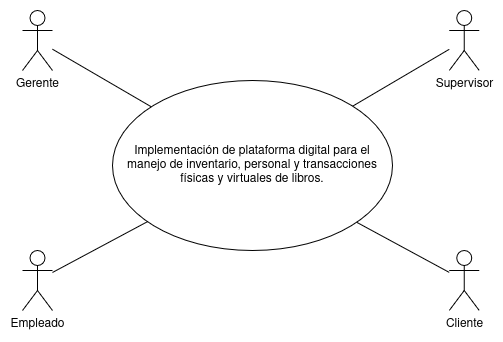
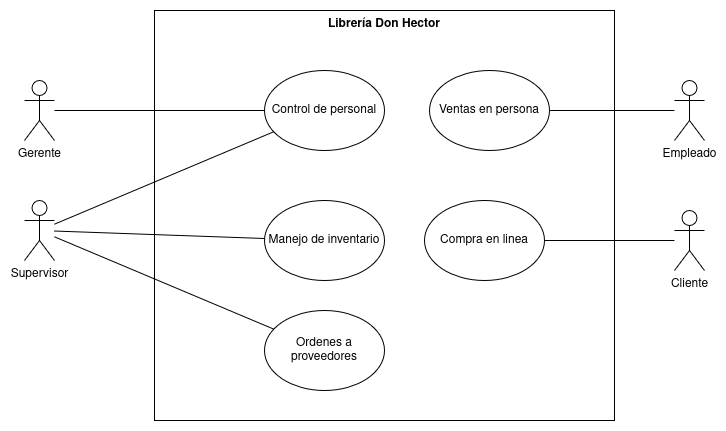
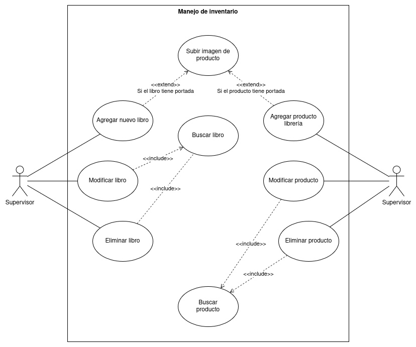
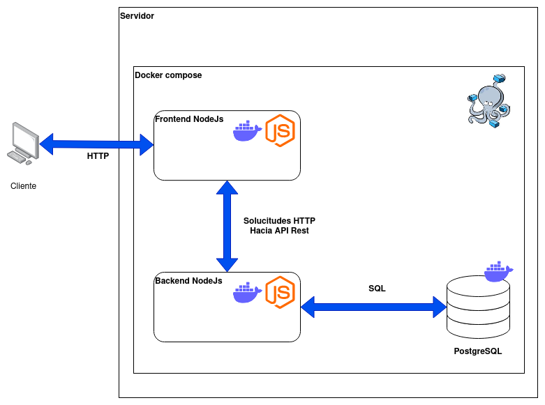
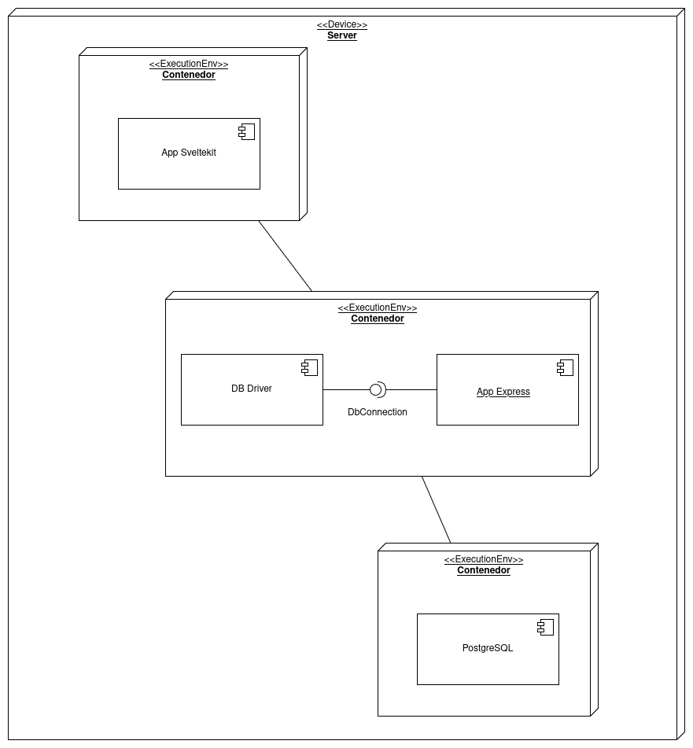

# Core del negocio

Librería Don Hector se especializa en la venta de libros y artículos de libería al por menor, tanto de forma física como por envios a domicilio.
Su estrategia se basa en el mantenimiento de una plataforma digital para el manejo de inventario, personal y transacciones físicas y virtuales,
así como un portal web abierto al público que sirve como tienda en linea.

# StakeHolders

- Gerente
- Supervisor
- Empleado
- Cliente

# CDU de alto nivel

## Primera descomposición

Procesos de negocio:
- Compra en linea
- Ventas en persona
- Manejo inventario
- Control personal
- Ordenes a proveedores

# CDU expandidos

## Manejo de inventario

listado:

- CDU-001: Subir imagen de producto
- CDU-002: Agregar nuevo libro
- CDU-003: Buscar libro
- CDU-004: Agregar producto librería
- CDU-005: Modificar libro
- CDU-006: Eliminar libro
- CDU-007: Modificar producto
- CDU-008: Eliminar producto
- CDU-009: Buscar producto

### Descripciones
- **ID:** CDU-002
- **Caso de uso:** Agregar nuevo libro
- **Descripción:** Los supervisores pueden agregar nuevos libros al sistema para poner a la venta
- **Actor Principal:** Supervisor
- **Precondiciones:**
    - El supervisor debe estar autenticado en la plataforma
- **Escenario Principal:**
    1. Se accede al modulo de libros
    2. Se ingresan los datos en el formulario de carga de libros
    3. Se agrega la imagen de portada del libro
    4. Se envian los datos al sistema
- **Escenario Alternativo:**
    - El libro no cuenta con una imagen de portada y puede dejarse vacia

# Requerimientos funcionales generales

## Requerimientos funcionales

- RF1: Los supervisores pueden agregar nuevos libros al sistema
- RF2: Los empleados pueden realizar ventas a través del sistema
- RF3: Al realizar una venta exitosa, se genera una factura automáticamente y se almacena en el sistema
- RF4: Los clientes pueden buscar libros a través de un buscador dentro del portal web
- RF5: Los clientes pueden registrarse en el portal web
- RF6: Los clientes pueden iniciar sersión en el portal web
- RF7: Los clientes pueden comprar libros a través del portal web

## Requerimientos no funcionales

### Seguridad
- RNF1: El sistema requiere autenticación para realizar gestiones de gerente, supervisor y empleado
- RNF2: Las contraseñas se almacenan encriptadas por medio de AES
- RNF3: Las sesiones de los usuaios autenticados expiran después de 24 horas

### Eficiencia
- RNF4: La busqueda de libros no debe tardar más de 3 segundos
- RNF5: Las ordenes de libros deben funcionar correctamente con 10,000 solucitudes concurrentes

### Usabilidad
- RNF6: El portal web debe ser responsive para mostrarse adecudamente en dispositivos moviles y de escritorio
- RNF7: El portal debe tener categorias de navegaciópn que hagan fácil encontrar la información de interés
- RNF8: Los clientes deben poder ver y modificar los contenidos carrito de compras desde cualquier vista del portal

### Disponibilidad
- RNF9: El sistema debe tener una disponibilidad del 99,99% anual
- RNF10: Los despliegues de nuevas funcionalidades no deben interrumpir a los usuarios en la plataforma

# Matrices trazabilidad
Solamente contienen los CDU en este documento. Las reales tendrían todos los requerimientos y CDU*

## Stakeholders vs CDU

| Stakeholder | CDU-001 | CDU-002 | CDU-003 | CDU-004 | CDU-005 | CDU-006 | CDU-007 | CDU-008 | CDU-009 | ... |
|-------------|:-------:|:-------:|:-------:|:-------:|:-------:|:-------:|:-------:|:-------:|:-------:|:---:|
| Gerente     |         |         |         |         |         |         |         |         |         |     |
| Supervisor  |    x    |    x    |    x    |    x    |    x    |    x    |    x    |    x    |    x    |     |
| Empleado    |         |         |         |         |         |         |         |         |         |     |
| Cliente     |         |         |         |         |         |         |         |         |         |     |

## Stakeholders vs Requerimientos

| stakeholder | RF1 | RF2 | RF3 | RF4 | RF5 | RF6 | RF7 | ... |
|-------------|:---:|:---:|:---:|:---:|:---:|:---:|:---:|:---:|
| Gerente     |     |     |     |     |     |     |     |     |
| Supervisor  |  x  |     |     |     |     |     |     |     |
| Empleado    |     |  x  |  x  |     |     |     |     |     |
| Cliente     |     |     |     |  x  |  x  |  x  |  x  |     |

## Requerimientos vs CDU

| Requerimento | CDU-001 | CDU-002 | CDU-003 | CDU-004 | CDU-005 | CDU-006 | CDU-007 | CDU-008 | CDU-009 | ... |
|--------------|:-------:|:-------:|:-------:|:-------:|:-------:|:-------:|:-------:|:-------:|---------|:---:|
| RF1          |         |    x    |         |         |         |         |         |         |         |     |
| RF2          |         |         |         |         |         |         |         |         |         |     |
| RF3          |         |         |         |         |         |         |         |         |         |     |
| RF4          |         |         |    x    |         |         |         |         |         |         |     |
| RF5          |         |         |         |         |         |         |         |         |         |     |
| RF6          |         |         |         |         |         |         |         |         |         |     |
| RF7          |         |         |         |         |         |         |         |         |         |     |

# Selección de estilo arquitectónico

Se escogío el estílo n-capas, ya que permite organizar los componentes según el propósito que cumplen y es especialmente
útil para aplicaciones web. La insfraestructura para el portal web es dinámica porque todas las capas pueden ir en
un mismo servidor, o cada capa puede ir en diferentes seridores/servicios, ya sea on-premise o en la nube.

En este caso, cada componente será ejectudo por medio de docker compose.

# Diagrama de bloques

# Diagrama de despliegue

