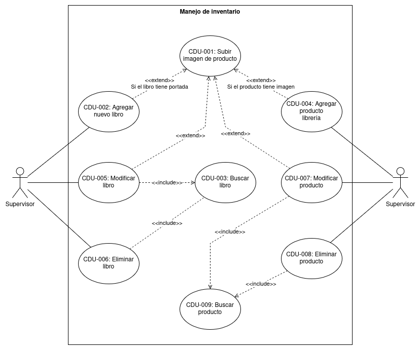

# Orden a seguir
En orden, para que su solución sea consistente y correcta, deberían hacer las sección en el siguiente orden.

Cada sección se toma del resultado de la anterior.
1. Core del negocio
2. CDU primera descomposición
    - La primera descomposición solo tiene los CDU de negocio
3. CDU expandidos
    - Hay que hacer un diagrama por cada CDU de negocio
    - Por cada CDU en los diagramas expandidos, se redacta el detalle/descripción
    - Hay que identificar cada CDU (eg. CDU001, CDU002, etc.)
4. Requerimientos funcionales y no funcionales
    - Los requerimientos funcionales y no funcionales se hacen a partir de los CDU que desarrollaron en los diagramas expandidos
    - Hay que identificarlos (eg. RF001, RNF001, etc.)
5. Matrices de trazabilidad
    - Se hacen a partir de los CDU expandidos y los requerimientos
    - Todos los requerimientos/CDU deberían tener al menos una relación
6. Estilos arquitectónicos
    - Tienen que redactar que partes del sistema tendrán X o Y estilo arquitectónico y por qué
    - Sean especificos
7. Diagrama de bloques
    - Hacerlo pensando en que alguien no-tecnico pueda entenderlo
    - Usar imaágenes y evitar usar lenguaje técnico.
8. Diagrama de despliegue
    - Debería ser la descripción tećnica del diagrama de bloques. La idea es que ambos diagramas describan la arquitectura del sistema
    - Si es muy grande, subanlo como .svg para que se pueda apreciar el detalle
    - Agregar los modelos para las entidades en la base de datos con relación a los componentes que los usen
9. Diagrama ER
    - Del diagrama de despliegue pudieronn sacar los modelos para las entidades, ahora con eso ya pueden tener una mejor idea de como hacer su diagrama ER
    - Si van a usar una db no-sql, no se hace diagrama ER pero sí tienen que hacer su diseño en base a consultas. Y describan los documentos en la colección
10. Patrones de diseño
    - Ya que pensaron toda su arquitectura y saben como está distribuida, ya pueden pensar en donde usar los patrónes de diseño.
    - Describan donde y por qué están usando el patrón
    - Hagan el diagrama de clases para el patrón
        - Usen las relaciones correctas entre clases
    - Son 5 patrones mínimo

# Core del negocio

Librería Don Hector se especializa en la venta de libros y artículos de libería al por menor, tanto de forma física como por envios a domicilio.
Su estrategia se basa en el mantenimiento de una plataforma digital para el manejo de inventario, personal y transacciones físicas y virtuales,
así como un portal web abierto al público que sirve como tienda en linea.

# StakeHolders

- Gerente
- Supervisor
- Empleado
- Cliente

# CDU de alto nivel

## Primera descomposición

Procesos de negocio:
- Compra en linea
- Ventas en persona
- Manejo inventario
- Control personal
- Ordenes a proveedores

# CDU expandidos

## Manejo de inventario

listado:

- CDU-001: Subir imagen de producto
- CDU-002: Agregar nuevo libro
- CDU-003: Buscar libro
- CDU-004: Agregar producto librería
- CDU-005: Modificar libro
- CDU-006: Eliminar libro
- CDU-007: Modificar producto
- CDU-008: Eliminar producto
- CDU-009: Buscar producto

### Descripciones
- **ID:** CDU-002
- **Caso de uso:** Agregar nuevo libro
- **Descripción:** Los supervisores pueden agregar nuevos libros al sistema para poner a la venta
- **Actor Principal:** Supervisor
- **Precondiciones:**
    - El supervisor debe estar autenticado en la plataforma
- **Escenario Principal:**
    1. Se accede al modulo de libros
    2. Se ingresan los datos en el formulario de carga de libros
    3. Se agrega la imagen de portada del libro
    4. Se envian los datos al sistema
- **Escenario Alternativo:**
    3a. El libro no cuenta con una imagen de portada y puede dejarse vacia
    4. Se envian los datos al sistema
- **Escenario Alternativo:**
    4a. El libro ya existe en el sistema
    5. Los datos son rechazados por el sistema

# Requerimientos funcionales generales

## Requerimientos funcionales

- RF1: Los supervisores pueden agregar libros al sistema
- RF2: Los supervisores pueden eliminar libros en el sistema
- RF3: Los supervisores pueden modificar libros en el sistema
- RF4: Los supervisores pueden agregar productos al sistema
- RF5: Los supervisores pueden eliminar productos en el sistema
- RF6: Los supervisores pueden modificar productos en el sistema
- RF7: Se pueden buscar libros en el sistema
- RF8: Se pueden buscar productos en el sistema
- RF9: Se pueden agregar imágenes a los productos
.
.
.
y aquí van todo el resto a partir de los CDU

## Requerimientos no funcionales

### Seguridad
- RNF1: El sistema requiere autenticación para realizar gestiones de gerente, supervisor y empleado
- RNF2: Las contraseñas se almacenan encriptadas por medio de AES
- RNF3: Las sesiones de los usuaios autenticados expiran después de 24 horas

### Eficiencia
- RNF4: La busqueda de libros no debe tardar más de 3 segundos
- RNF5: Las ordenes de libros deben funcionar correctamente con 10,000 solucitudes concurrentes

### Usabilidad
- RNF6: El portal web debe ser responsive para mostrarse adecudamente en dispositivos moviles y de escritorio
- RNF7: El portal debe tener categorias de navegaciópn que hagan fácil encontrar la información de interés
- RNF8: Los clientes deben poder ver y modificar los contenidos carrito de compras desde cualquier vista del portal

### Disponibilidad
- RNF9: El sistema debe tener una disponibilidad del 99,99% anual
- RNF10: Los despliegues de nuevas funcionalidades no deben interrumpir a los usuarios en la plataforma
.
.
.
Hacer el resto con los CDU

# Matrices trazabilidad
Solamente contienen los CDU en este documento. Las reales tendrían todos los requerimientos y CDU*

## Stakeholders vs CDU

| Stakeholder | CDU-001 | CDU-002 | CDU-003 | CDU-004 | CDU-005 | CDU-006 | CDU-007 | CDU-008 | CDU-009 | ... |
|-------------|:-------:|:-------:|:-------:|:-------:|:-------:|:-------:|:-------:|:-------:|:-------:|:---:|
| Gerente     |         |         |         |         |         |         |         |         |         |     |
| Supervisor  |    x    |    x    |    x    |    x    |    x    |    x    |    x    |    x    |    x    |     |
| Empleado    |         |         |         |         |         |         |         |         |         |     |
| Cliente     |         |         |         |         |         |         |         |         |         |     |

## Stakeholders vs Requerimientos

| stakeholder | RF1 | RF2 | RF3 | RF4 | RF5 | RF6 | RF7 | RF8 | RF9 | ... |
|-------------|:---:|:---:|:---:|:---:|:---:|:---:|:---:|:---:|:---:|:---:|
| Gerente     |     |     |     |     |     |     |     |     |     |     |
| Supervisor  |  x  |  x  |  x  |  x  |  x  |  x  |  x  |  x  |  x  |     |
| Empleado    |     |     |     |     |     |     |     |     |     |     |
| Cliente     |     |     |     |     |     |     |     |     |     |     |

## Requerimientos vs CDU

| Requerimento | CDU-001 | CDU-002 | CDU-003 | CDU-004 | CDU-005 | CDU-006 | CDU-007 | CDU-008 | CDU-009 | ... |
|--------------|:-------:|:-------:|:-------:|:-------:|:-------:|:-------:|:-------:|:-------:|---------|:---:|
| RF1          |         |    x    |         |         |         |         |         |         |         |     |
| RF2          |         |         |         |         |         |    x    |         |         |         |     |
| RF3          |         |         |         |         |    x    |         |         |         |         |     |
| RF4          |         |         |         |    x    |         |         |         |         |         |     |
| RF5          |         |         |         |         |         |         |         |    x    |         |     |
| RF6          |         |         |         |         |         |         |    x    |         |         |     |
| RF7          |         |         |    x    |         |    x    |    x    |         |         |         |     |
| RF8          |         |         |         |         |         |         |    x    |    x    |    x    |     |
| RF9          |    x    |    x    |         |    x    |    x    |         |    x    |         |         |     |

# Selección de estilo arquitectónico

Se escogío el estílo n-capas, ya que permite organizar los componentes según el propósito que cumplen y es especialmente
útil para aplicaciones web. La insfraestructura para el portal web es dinámica porque todas las capas van en dispositivos diferentes, ya sea on-premise o en la nube.

- Capa presentación: En esta capa irá una aplicación sveltekit
- Capa lógica:
    - En esta capa irá una aplicación de Express
    - Usaremos un servicio externo para el envio de correos
- Capa datos:
    - Se utilizará PostgreSQL para la persistencia de datos
    - Los documentos estáticos como facturas e imágenes irán en un servidor aparte

# Diagrama de bloques

# Diagrama de despliegue
* este es mejor subirlo como .svg porque suele ser grande

